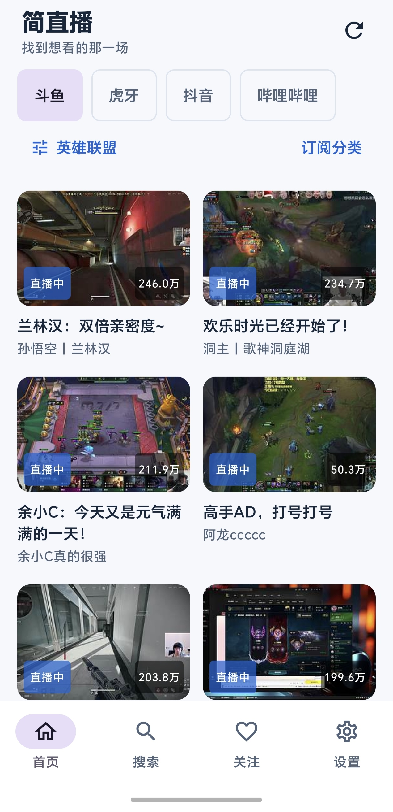
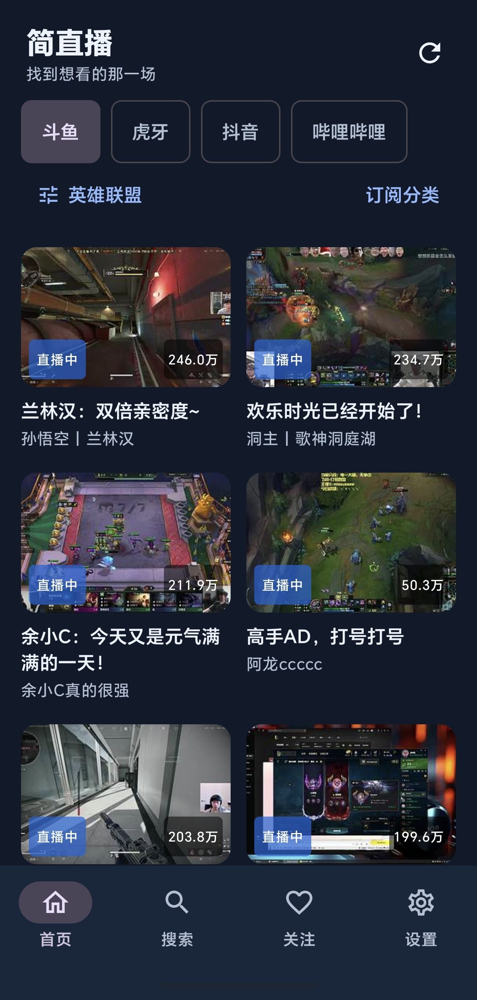

# Simple-live 简直播

Simple-live 是一个用于学习和研究跨平台直播客户端技术的非商业开源项目，可在用户设备本地访问部分第三方平台公开直播内容。

- 个人维护、免费使用，不收费、不接广告、不提供会员，不运营商业直播服务。
- 项目本身不提供直播内容，不在开发者服务器存储、托管、上传或转播直播视频。内容及权益归主播、平台及相应权利人所有。
- 用户设备直接请求相关平台 API/CDN；设备内部使用受限的本机播放兼容层，不经过开发者中转服务器。
- 不提供付费内容破解、会员绕过、DRM 或访问控制绕过、公共直播源解析 API、直播下载、录制、源地址分享或导出。
- 保留搜索主播、查看直播状态、播放公开免费直播、本地关注与基础播放器操作。平台限制访问时功能可能暂不可用。
- 请遵守所在地法律法规及相关平台服务条款。权利人可通过 [GitHub Issue](https://github.com/kanxi12138/Simple-live/issues) 联系维护者核实并处理侵权问题。

详见 [功能边界](COMPLIANCE.md)、[隐私说明](PRIVACY.md)、[安全政策](SECURITY.md) 和 [审计报告](docs/compliance-audit.md)。现有 Cookie 保存方式仍有明文存储风险；配置导出不包含 Cookie。

## 开源许可与第三方版权

整体按 [GNU GPL version 3](LICENSE) 分发。平台适配派生自 xiaoyaocz/dart_simple_live 指定提交，原 DTV 的 MIT 版权声明及其他依赖许可证继续保留，见 [第三方声明](THIRD_PARTY_NOTICES.md)。非商业是维护者的运营选择，不对 GPL 授予的权利增加限制。App 设置中可离线查看许可证和隐私说明。

发布 APK 时需提供对应提交的完整源码、依赖和构建说明，见 [构建说明](docs/build.md)。本次提交不创建 Release；现有历史 APK 不代表完成本次整改。

## 特别注意的使用方法

1. 打开 app 后，先根据你的观看习惯选择对应的直播平台，再进入首页浏览或搜索主播。
2. 如果你已经知道主播房间号，可以直接搜索并进入播放页；如果主播暂时未开播，播放区域会明确提示当前未开播状态。
3. 常用操作包括关注主播、管理关注列表、导入或导出配置、检查更新，这些功能都可以在 app 内直接完成。
4. 第一次使用时，建议先熟悉首页、搜索页、播放页和设置页的切换方式，再进行长期使用配置。
5. 本文档中的页面示例图片全部使用相对路径引用，便于在当前目录下直接预览。

## 页面示例

## 使用的技术栈

- 前端：Vue 3、TypeScript、Vite、Pinia、Vue Router
- 播放器：xgplayer、xgplayer-flv、xgplayer-hls.js
- 桌面与移动容器：Tauri 2
- 原生与后端能力：Rust、tokio、reqwest、actix-web

原项目灵感来源于 [DTV](https://github.com/chen-zeong/DTV)。
